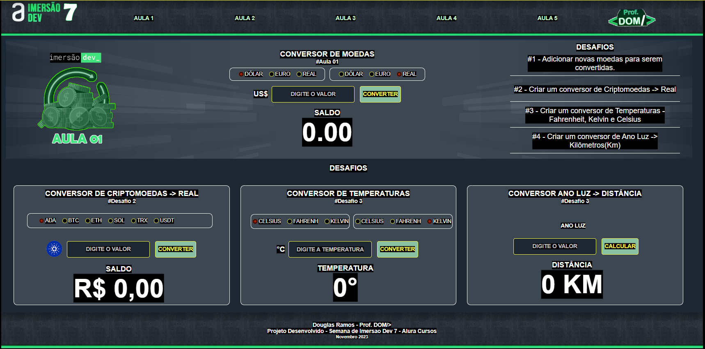

#AULA 01 - CONVERSOR DE MOEDAS.

#1 - Descritivo  
    Desenvolver um conversor de moedas de Dólar, Real e Euro.
        - Dólar -> Real
        - Dólar -> Euro
        - Euro -> Real

#2 - Wireframe.

#3 - Layout Final da Página.

 

 

#4 - POWERED BY:

 
 
 

